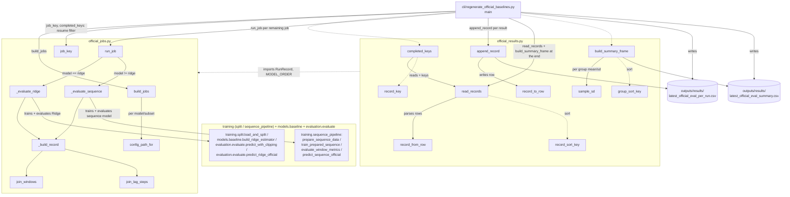

# Benchmarks Architecture

`benchmarks/` regenerates the official C-MAPSS benchmark CSVs. `official_jobs.py`
enumerates and runs train+evaluate jobs (delegating the actual train/evaluate
work to the shared pipeline modules documented in
[the shared train/evaluate pipeline diagram](../workflows/shared-pipeline-usage.md));
`official_results.py` persists `RunRecord`s to CSV and aggregates them into the
summary frame. The only external entrypoint is the
`turbofan-regenerate-baselines` CLI.

## Notes

- **Resumability**: `main` reads `completed_keys` from the existing per-run CSV
  and filters jobs whose `job_key` (model, subset, seed) is already present, so
  an interrupted sweep can restart without recomputing finished jobs.
- **Ridge vs. sequence**: `run_job` dispatches purely on `job.model == "ridge"`;
  both branches funnel into `_build_record`, which fills in the
  sequence-specific columns (`sequence_window`, `hidden_size`,
  `learning_rate`) as empty strings for Ridge.
- `official_results.py` depends on `official_jobs.py` only for the `RunRecord`
  dataclass and `MODEL_ORDER` (display/sort order) — it has no knowledge of
  how a record was produced.
