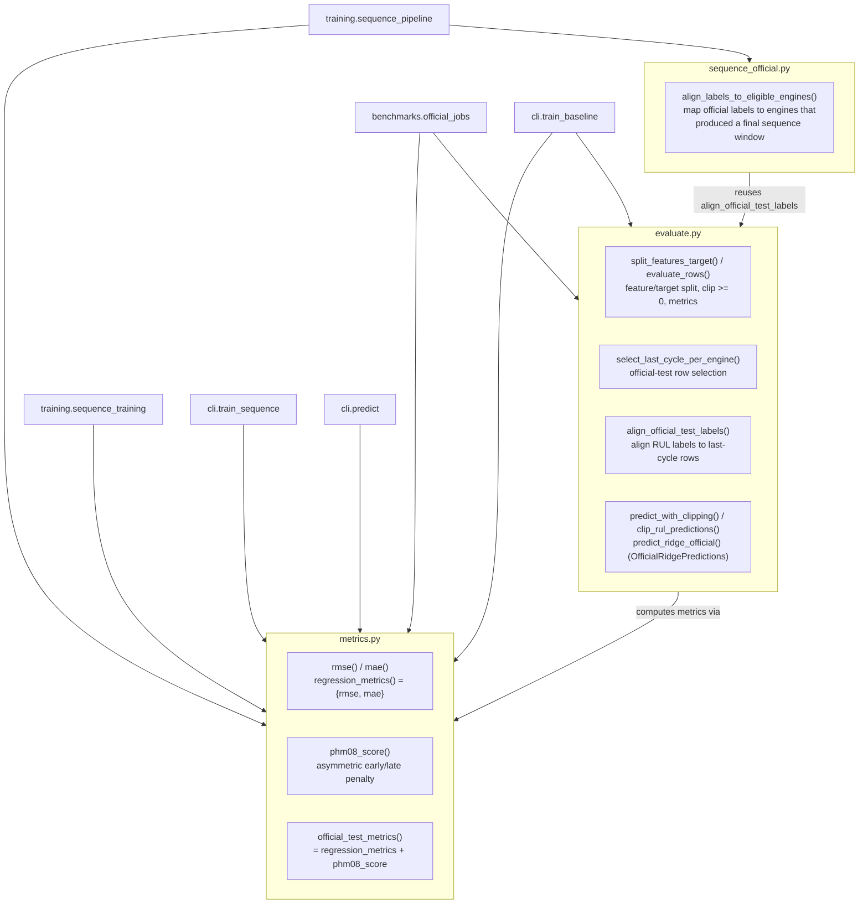

# Evaluation Architecture

`evaluation/` owns evaluation primitives: regression metrics, prediction
selection, official-label alignment, and the Ridge/sequence official-test
helpers. Reproducible benchmark job execution and reporting live in
`turbofan.benchmarks`.

