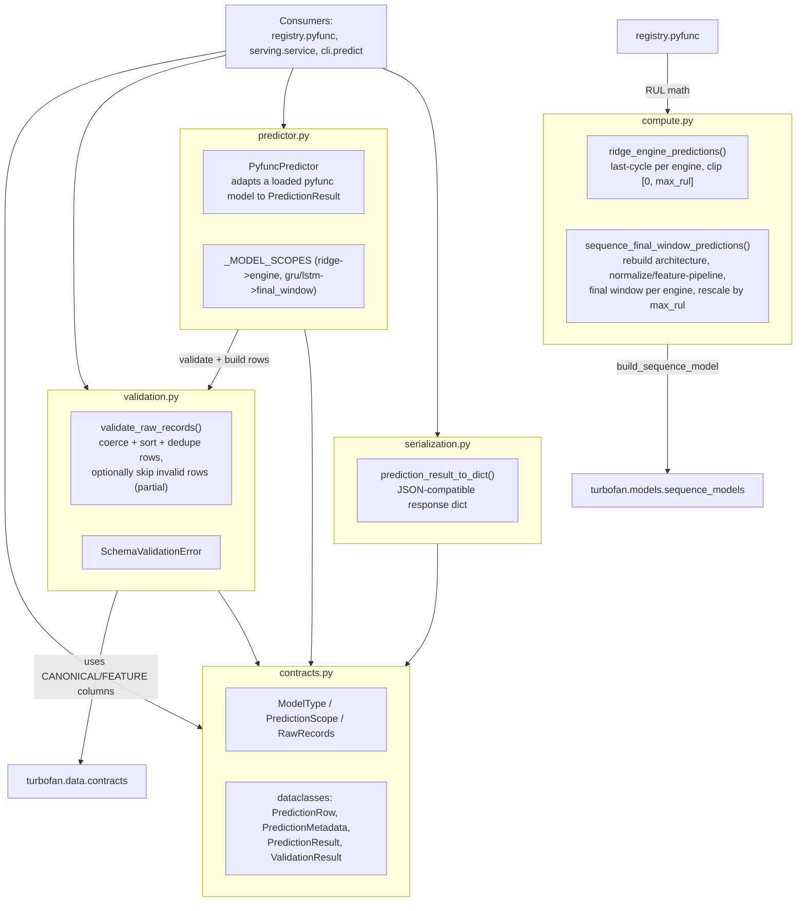

# Predictions Architecture

`predictions/` is the inward-facing inference core: contracts, validation,
RUL-compute math, the loaded-model predictor adapter, and result serialization.
It is transport- and MLflow-free. The registry, FastAPI service, and batch CLI
consume it.

