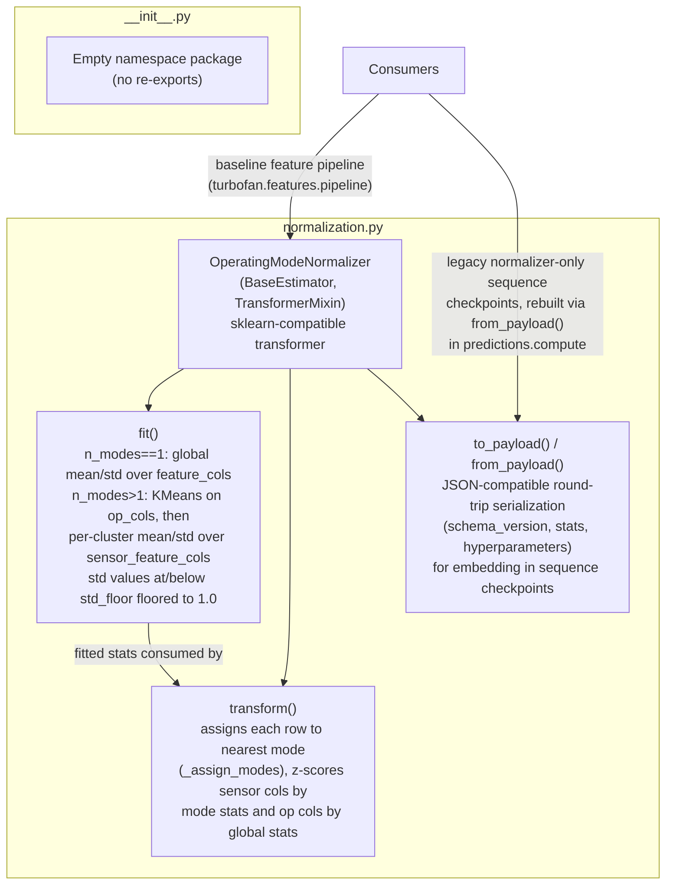

# Preprocessing Architecture

```mermaid
flowchart TD
    subgraph init_py["__init__.py"]
        I1["Empty namespace package\n(no re-exports)"]
    end

    subgraph normalization_py["normalization.py"]
        N1["OperatingModeNormalizer\n(BaseEstimator, TransformerMixin)\nsklearn-compatible transformer"]
        N2["fit()\nn_modes==1: global mean/std over feature_cols\nn_modes>1: KMeans on op_cols, then\nper-cluster mean/std over sensor_feature_cols\nstd values at/below std_floor floored to 1.0"]
        N3["transform()\nassigns each row to nearest mode\n(_assign_modes), z-scores sensor cols by\nmode stats and op cols by global stats"]
        N4["to_payload() / from_payload()\nJSON-compatible round-trip serialization\n(schema_version, stats, hyperparameters)\nfor embedding in sequence checkpoints"]
    end

    N1 --> N2
    N1 --> N3
    N2 -->|"fitted stats consumed by"| N3
    N1 --> N4

    Consumers["Consumers"]
    Consumers -->|"baseline feature pipeline\n(turbofan.features.pipeline)"| N1
    Consumers -->|"legacy normalizer-only sequence\ncheckpoints, rebuilt via from_payload()\nin predictions.compute"| N4
```
