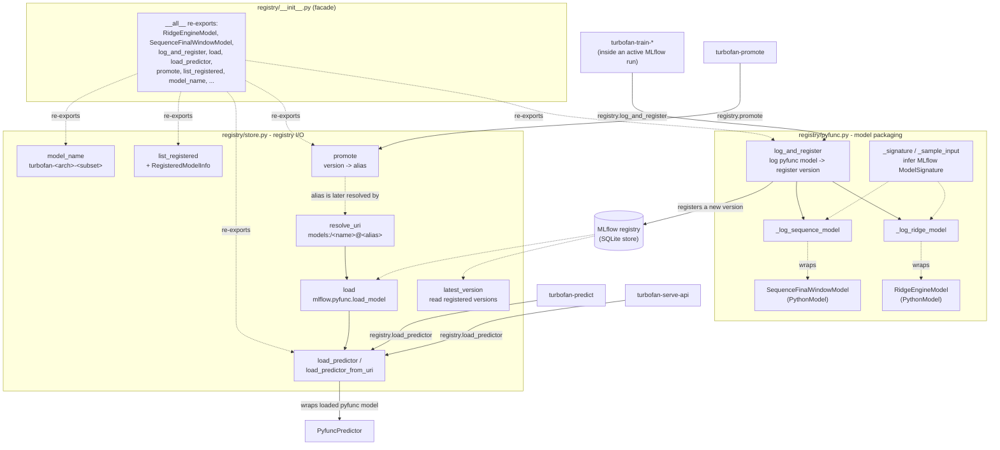
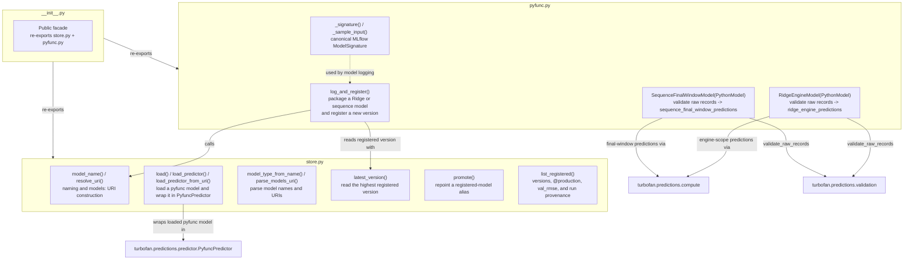

# Registry Architecture

`turbofan.registry` is the MLflow infrastructure adapter. Its public facade
re-exports package operations; model packaging lives in `pyfunc.py`, and
registry I/O lives in `store.py`. Registering a model creates a version only.
Promotion is a separate, explicit alias operation.

## Module-level ownership

