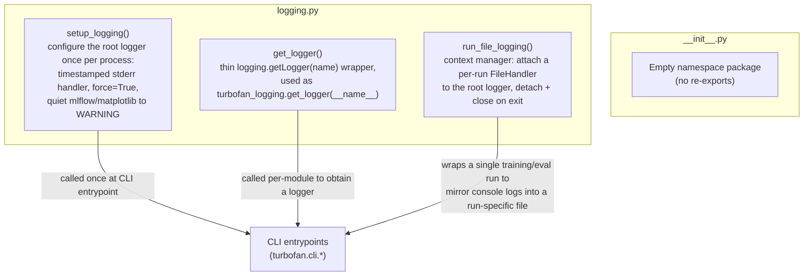

# Utilities Architecture

```mermaid
flowchart TD
    subgraph init_py["__init__.py"]
        I1["Empty namespace package\n(no re-exports)"]
    end

    subgraph logging_py["logging.py"]
        L1["setup_logging()\nconfigure the root logger once per process:\ntimestamped stderr handler, force=True,\nquiet mlflow/matplotlib to WARNING"]
        L2["get_logger()\nthin logging.getLogger(name) wrapper,\nused as turbofan_logging.get_logger(__name__)"]
        L3["run_file_logging()\ncontext manager: attach a per-run FileHandler\nto the root logger, detach + close on exit"]
    end

    L1 -->|"called once at CLI entrypoint"| Callers["CLI entrypoints\n(turbofan.cli.*)"]
    L2 -->|"called per-module to obtain a logger"| Callers
    L3 -->|"wraps a single training/eval run to\nmirror console logs into a run-specific file"| Callers
```
