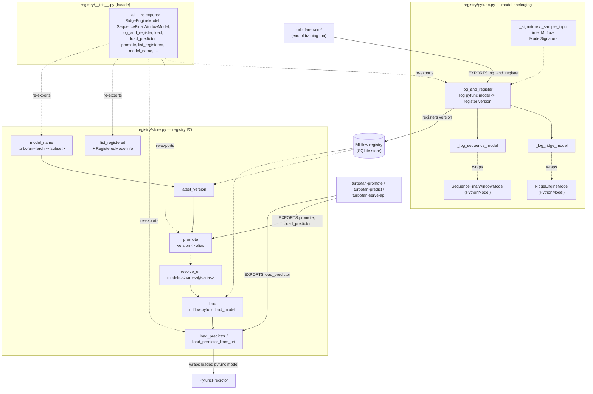

# Registry Package

`registry/__init__.py` is a pure re-export facade preserving the historical
`turbofan.registry` import path; the real logic lives in `pyfunc.py` (model
packaging) and `store.py` (registry I/O). Callers outside the package import
only from `registry`, never from the submodules directly.

