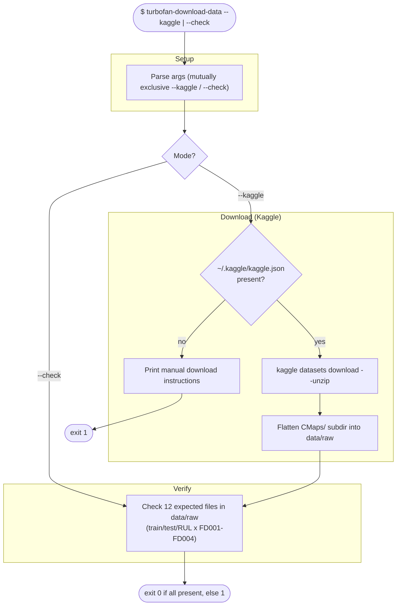

# Workflow: `turbofan-download-data`

What happens when downloading or verifying the NASA C-MAPSS dataset. One of two
mutually exclusive modes: `--check` (verify files) or `--kaggle` (download then
verify).

## Step reference

| Step | Function | Module |
|---|---|---|
| Verify files | `check` | `cli/download_data.py` |
| Download | `download_kaggle` | `cli/download_data.py` |

Note: this command is foundation-only — it touches just `utils` (logging) and
the filesystem; no config, models, or registry are involved.
