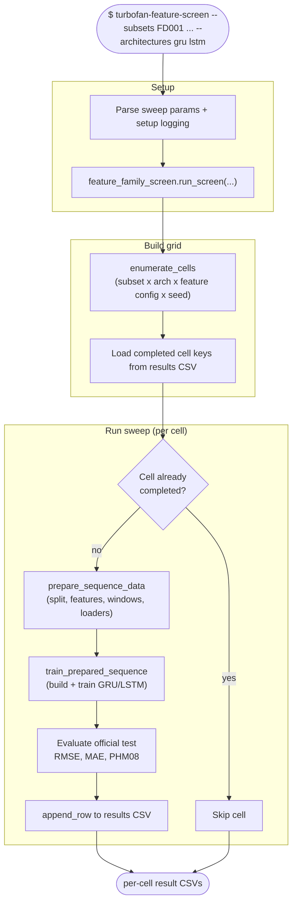

# Workflow: `turbofan-feature-screen`

What happens during the feature-family sweep: enumerate a grid of
(subset × architecture × feature config × seed) cells and, for each, run the
shared sequence pipeline and append a result row. Resumable — completed cells
are skipped.

## Step reference

| Step | Function | Module |
|---|---|---|
| Enumerate grid | `feature_family_grid.enumerate_cells` | `experiments/feature_family_grid.py` |
| Resume keys | `feature_family_results.completed_keys` | `experiments/feature_family_results.py` |
| Orchestrate | `feature_family_screen.run_screen` | `experiments/feature_family_screen.py` |
| Prepare/train | `sequence_pipeline.prepare_sequence_data` / `train_prepared_sequence` | `training/sequence_pipeline.py` |
| Append row | `feature_family_results.append_row` | `experiments/feature_family_results.py` |
