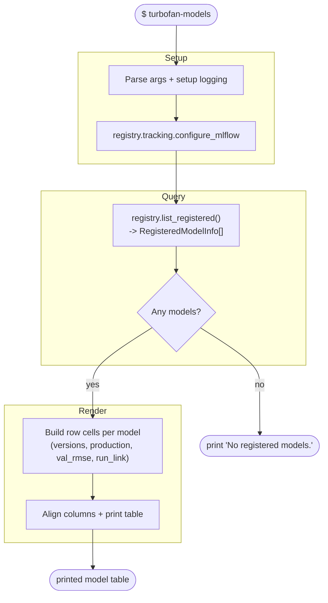

# Workflow: `turbofan-models`

What happens when listing registered models: query the registry and print a
greppable table (name, versions, `@production` version, production `val_rmse`,
run link).

## Step reference

| Step | Function | Module |
|---|---|---|
| Configure MLflow | `registry.tracking.configure_mlflow` | `registry/tracking.py` |
| List models | `registry.list_registered` | `registry/` |
| Resolve run link | `registry.resolve_uri` | `registry/` |
