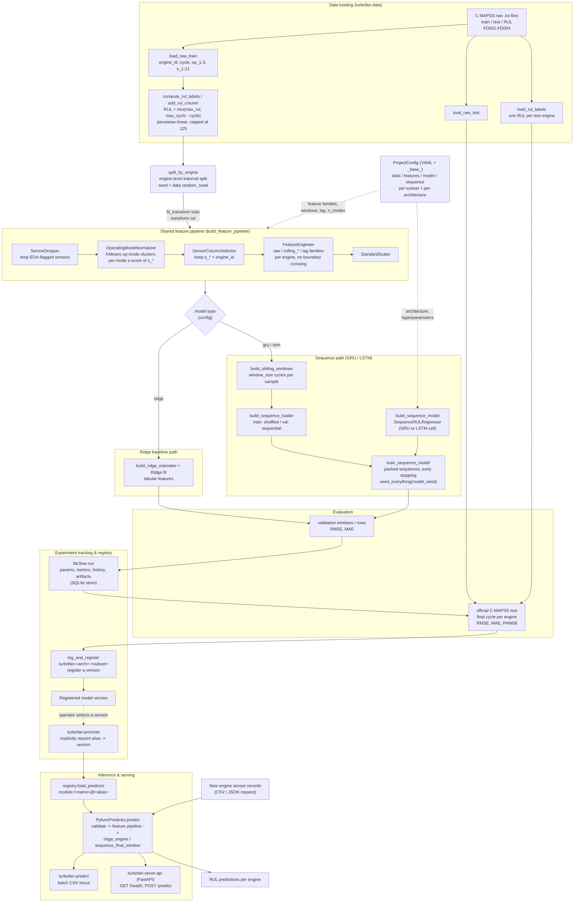

# Workflow Overview: End-to-End Pipeline

End-to-end view of the turbofan RUL workflow, from raw C-MAPSS data loading
through training, the MLflow registry, and inference/serving. The Docker
deployment path is intentionally omitted.

This is the big picture the per-command workflow docs zoom into: training maps to
[`train-baseline`](train-baseline.md) / [`train-sequence`](train-sequence.md),
registry promotion to [`promote-model`](promote-model.md), and inference to
[`predict`](predict.md) / [`serve-api`](serve-api.md). See the
[index](README.md) for all commands.

The shared preprocessing contract is
`SensorDropper → OperatingModeNormalizer → SensorColumnSelector → FeatureEngineer → StandardScaler`
(`build_feature_pipeline`), used identically by the Ridge baseline, the
sequence models, and inference.

## Stage summary

| Stage | Key modules | What happens |
|---|---|---|
| Data loading | `data/loader.py`, `data/labels.py` | Read raw `.txt` files; compute capped piecewise-linear RUL labels. |
| Split | `training/split.py` | Engine-level train/validation split seeded by `data.random_seed`. |
| Features | `features/pipeline.py`, `features/engineering.py` | Shared 5-step sklearn pipeline; same fitted pipeline reused at inference. |
| Ridge | `models/baseline.py` | Linear baseline over engineered tabular features. |
| Sequence | `sequences/windowing.py`, `models/sequence_models.py`, `training/sequence_*` | Sliding windows → loaders → GRU/LSTM `SequenceRULRegressor`. |
| Evaluation | `evaluation/evaluate.py`, `evaluation/metrics.py` | Validation RMSE/MAE; official-test RMSE/MAE/PHM08 at final cycle. |
| Tracking/Registry | `registry/tracking.py`, `registry/` | Log to MLflow; register and promote model versions by alias. |
| Inference | `predictions/*`, `serving/*`, `cli/predict.py`, `cli/serve_api.py` | Resolve model by name/alias; batch CSV or FastAPI `/predict`. |
