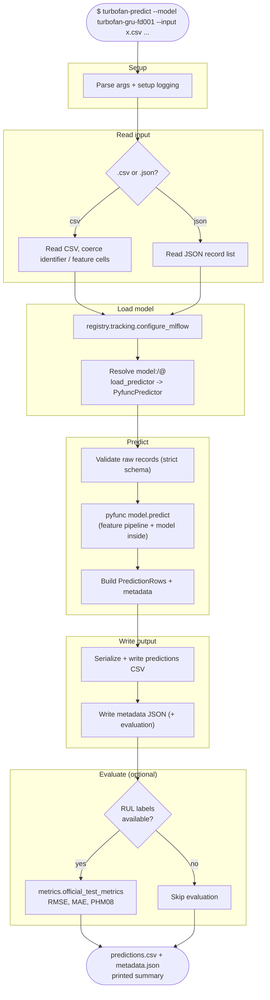

# Workflow: `turbofan-predict`

What happens during batch inference, from invocation to a written predictions
CSV. Resolves the production model from the registry and runs it over a CSV/JSON
input file.

## Step reference

| Step | Function | Module |
|---|---|---|
| Read records | `_read_records` | `cli/predict.py` |
| Resolve model | `registry.load_predictor` / `load_predictor_from_uri` | `registry/` |
| Validate | `validation.validate_raw_records` | `predictions/validation.py` |
| Predict | `PyfuncPredictor.predict` | `predictions/predictor.py` |
| Serialize | `serialization.prediction_result_to_dict` | `predictions/serialization.py` |
| Evaluate | `metrics.official_test_metrics` | `evaluation/metrics.py` |
