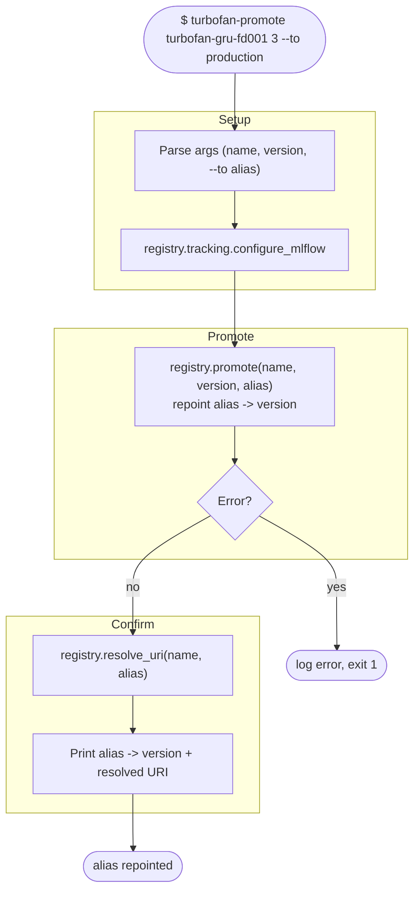

# Workflow: `turbofan-promote`

What happens when promoting a registered model version to an alias (e.g.
`@production`). Repoints the alias immediately with no approval gate; rollback is
the same operation against an earlier version.

## Step reference

| Step | Function | Module |
|---|---|---|
| Configure MLflow | `registry.tracking.configure_mlflow` | `registry/tracking.py` |
| Promote | `registry.promote` | `registry/` |
| Resolve URI | `registry.resolve_uri` | `registry/` |
