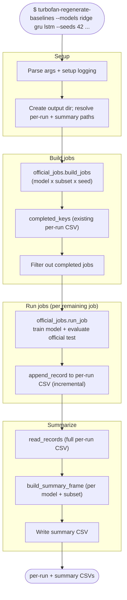

# Workflow: `turbofan-regenerate-baselines`

What happens when regenerating the official-evaluation snapshots: for every
production config, train the model and evaluate it on the official C-MAPSS test
set, writing per-run and summary CSVs. Resumable, and **no MLflow run is created
and the registry is never touched.**

## Step reference

| Step | Function | Module |
|---|---|---|
| Build jobs | `official_jobs.build_jobs` | `benchmarks/official_jobs.py` |
| Resume filter | `official_results.completed_keys` | `benchmarks/official_results.py` |
| Train + eval | `official_jobs.run_job` | `benchmarks/official_jobs.py` |
| Append record | `official_results.append_record` | `benchmarks/official_results.py` |
| Summary | `official_results.build_summary_frame` | `benchmarks/official_results.py` |
