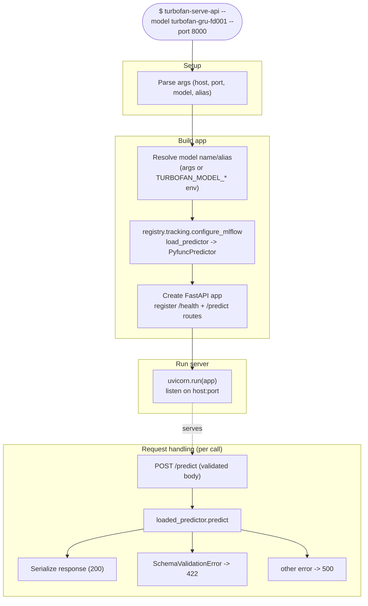

# Workflow: `turbofan-serve-api`

What happens when you start the FastAPI inference service: build the app, load
one registered model at startup, then serve prediction requests over the same
inference core used by [`predict`](predict.md).

## Step reference

| Step | Function | Module |
|---|---|---|
| Create app | `service.create_app` | `serving/service.py` |
| Resolve model | `registry.load_predictor` | `registry/` |
| Predict (per request) | `PyfuncPredictor.predict` | `predictions/predictor.py` |
| Validation error → 422 | `validation.SchemaValidationError` | `predictions/validation.py` |
| Serialize response | `serialization.prediction_result_to_dict` | `predictions/serialization.py` |
