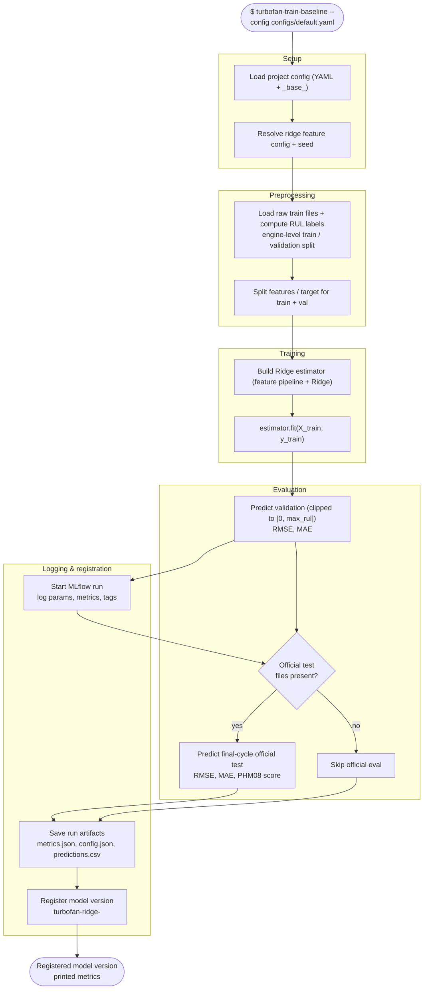

# Workflow: `turbofan-train-baseline`

What happens when you train the Ridge tabular baseline, from invocation to a
registered model version. The sibling of
[`train-sequence`](train-sequence.md) on the tabular (non-windowed) path.

## Step reference

| Step | Function | Module |
|---|---|---|
| Load config | `schema.load_config` | `config/schema.py` |
| Split | `split.load_and_split` | `training/split.py` |
| Features/target | `evaluate.split_features_target` | `evaluation/evaluate.py` |
| Build estimator | `baseline.build_ridge_estimator` | `models/baseline.py` |
| Validation eval | `evaluate.predict_with_clipping` + `metrics.regression_metrics` | `evaluation/` |
| Official-test eval | `evaluate.predict_ridge_official` | `evaluation/evaluate.py` |
| Log run | `registry.tracking.log_*` + `mlflow.*` | `cli/train_baseline.py`, `registry/tracking.py` |
| Register | `registry.log_and_register` | `registry/__init__.py` |
