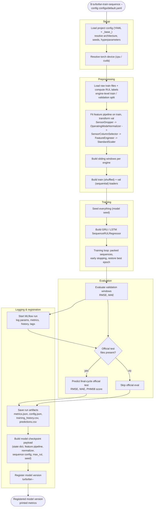

# Workflow: `turbofan-train-sequence`

What happens when you run the sequence-training command, from invocation to a
registered model version.

## Step reference

| Step | Function | Module |
|---|---|---|
| Load config | `schema.load_config` | `config/schema.py` |
| Resolve device | `sequence_training.resolve_device` | `training/sequence_training.py` |
| Prepare data | `sequence_pipeline.prepare_sequence_data` | `training/sequence_pipeline.py` |
| Train | `sequence_pipeline.train_prepared_sequence` | `training/sequence_pipeline.py` |
| Validation eval | `sequence_pipeline.evaluate_window_metrics` | `training/sequence_pipeline.py` |
| Official-test eval | `sequence_pipeline.predict_sequence_official` | `training/sequence_pipeline.py` |
| Log run | `registry.tracking.log_*` + `mlflow.*` | `cli/train_sequence.py`, `registry/tracking.py` |
| Register | `registry.log_and_register` | `registry/__init__.py` |
