# Shared Train/Evaluate Pipeline Usage

The shared train/evaluate building blocks (load+split, feature-pipeline
fitting, sequence window/loader prep, model training, and official-test
prediction for both Ridge and sequence models) live across
`turbofan/models/split.py`, `turbofan/models/baseline.py`,
`turbofan/models/evaluate.py`, and `turbofan/models/sequence_pipeline.py`.
Three production/experiment call sites import them to avoid duplicating this
logic: the production training CLIs, the official-evaluation sweep, and the
experiment harness.

```mermaid
flowchart TD
    subgraph SPLIT["turbofan/models/split.py"]
        LAS["load_and_split"]
    end

    subgraph BASE["turbofan/models/baseline.py"]
        BRE["build_ridge_estimator"]
    end

    subgraph EVAL["turbofan/models/evaluate.py"]
        PWC["predict_with_clipping"]
        PRO["predict_ridge_official"]
        CRP["clip_rul_predictions"]
        PWC -.->|uses| CRP
        PRO -.->|uses| CRP
    end

    subgraph SEQ["turbofan/models/sequence_pipeline.py"]
        PSD["prepare_sequence_data"]
        TPS["train_prepared_sequence"]
        EWM["evaluate_window_metrics"]
        PSO["predict_sequence_official"]
        PSO -.->|uses| CRP
    end

    LAS --> BRE

    subgraph TB["cli/train_baseline.py (production Ridge training)"]
        TBMAIN["main"]
        TBPRED["_predict_with_clipping<br/>(thin wrapper)"]
        TBEVAL["_evaluate_official_test"]
        TBMAIN -->|load_and_split| LAS
        TBMAIN -->|build_ridge_estimator| BRE
        TBPRED -->|predict_with_clipping| PWC
        TBEVAL -->|predict_ridge_official| PRO
    end

    subgraph TS["cli/train_sequence.py (production sequence training)"]
        TSMAIN["main"]
        TSEVAL["_evaluate_windows"]
        TSOFF["_evaluate_official_test"]
        TSMAIN -->|prepare_sequence_data| PSD
        TSMAIN -->|train_prepared_sequence| TPS
        TSEVAL -->|evaluate_window_metrics| EWM
        TSOFF -->|predict_sequence_official| PSO
    end

    subgraph OJ["evaluation/official_jobs.py (official-eval sweep)"]
        OJRIDGE["_evaluate_ridge"]
        OJSEQ["_evaluate_sequence"]
        OJRIDGE -->|load_and_split| LAS
        OJRIDGE -->|build_ridge_estimator| BRE
        OJRIDGE -->|predict_with_clipping| PWC
        OJRIDGE -->|predict_ridge_official| PRO
        OJSEQ -->|prepare_sequence_data| PSD
        OJSEQ -->|train_prepared_sequence| TPS
        OJSEQ -->|evaluate_window_metrics| EWM
        OJSEQ -->|predict_sequence_official| PSO
    end

    subgraph FFS["experiments/feature_family_screen.py (feature-family screen)"]
        FFSCELL["run_cell"]
        FFSCELL -->|prepare_sequence_data| PSD
        FFSCELL -->|train_prepared_sequence| TPS
    end

    RUNCLI["turbofan-train-baseline"] --> TBMAIN
    RUNCLI2["turbofan-train-sequence"] --> TSMAIN
    RUNSWEEP["regenerate_official_baselines<br/>(official-eval sweep entrypoint)"] --> OJRIDGE
    RUNSWEEP --> OJSEQ
    RUNSCREEN["feature_family_screen<br/>(experiment entrypoint)"] --> FFSCELL
```

## Notes

- **Seed discipline**: `data_seed` drives `load_and_split`/`prepare_sequence_data`
  (engine split + feature-pipeline `random_state`); `model_seed` is passed
  separately into `train_prepared_sequence`. They coincide in production
  training and diverge in the official-eval sweep and screen, where the data
  seed is pinned to 42 and only the model seed varies.
- **Ridge vs. sequence paths** are independent — Ridge call sites use
  `split.load_and_split` / `baseline.build_ridge_estimator` /
  `evaluate.predict_with_clipping` / `evaluate.predict_ridge_official`;
  sequence call sites use `sequence_pipeline.prepare_sequence_data` /
  `sequence_pipeline.train_prepared_sequence` /
  `sequence_pipeline.evaluate_window_metrics` /
  `sequence_pipeline.predict_sequence_official`.
  `evaluation/official_jobs.py` is the only caller exercising both paths.
- `cli/train_baseline.py`'s `_predict_with_clipping` is documented as a thin
  wrapper over `turbofan.models.evaluate.predict_with_clipping`.
