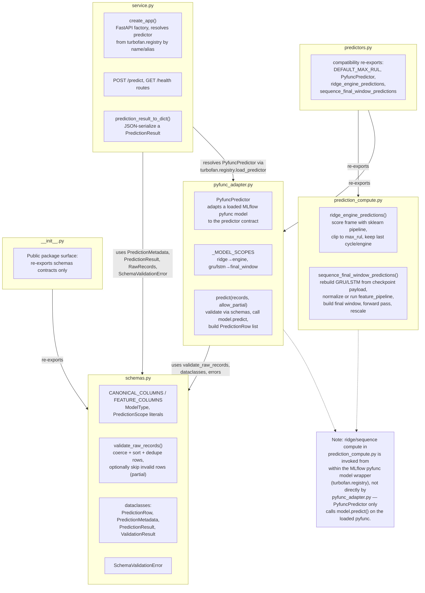

# `turbofan.inference` Package Modules

```mermaid
flowchart TD
    subgraph schemas_py["schemas.py"]
        S1["CANONICAL_COLUMNS / FEATURE_COLUMNS\nModelType, PredictionScope literals"]
        S2["validate_raw_records()\ncoerce + sort + dedupe rows,\noptionally skip invalid rows (partial)"]
        S3["dataclasses:\nPredictionRow, PredictionMetadata,\nPredictionResult, ValidationResult"]
        S4["SchemaValidationError"]
    end

    subgraph prediction_compute_py["prediction_compute.py"]
        PC1["ridge_engine_predictions()\nscore frame with sklearn pipeline,\nclip to max_rul, keep last cycle/engine"]
        PC2["sequence_final_window_predictions()\nrebuild GRU/LSTM from checkpoint payload,\nnormalize or run feature_pipeline,\nbuild final window, forward pass, rescale"]
    end

    subgraph pyfunc_adapter_py["pyfunc_adapter.py"]
        PA1["PyfuncPredictor\nadapts a loaded MLflow pyfunc model\nto the predictor contract"]
        PA2["_MODEL_SCOPES\nridge→engine, gru/lstm→final_window"]
        PA3["predict(records, allow_partial)\nvalidate via schemas, call model.predict,\nbuild PredictionRow list"]
    end

    subgraph predictors_py["predictors.py"]
        PR1["compatibility re-exports:\nDEFAULT_MAX_RUL, PyfuncPredictor,\nridge_engine_predictions,\nsequence_final_window_predictions"]
    end

    subgraph service_py["service.py"]
        SV1["create_app()\nFastAPI factory, resolves predictor\nfrom turbofan.registry by name/alias"]
        SV2["POST /predict, GET /health routes"]
        SV3["prediction_result_to_dict()\nJSON-serialize a PredictionResult"]
    end

    subgraph init_py["__init__.py"]
        I1["Public package surface:\nre-exports schemas contracts only"]
    end

    pyfunc_adapter_py -->|"uses validate_raw_records,\ndataclasses, errors"| schemas_py
    predictors_py -->|"re-exports"| prediction_compute_py
    predictors_py -->|"re-exports"| pyfunc_adapter_py
    service_py -->|"uses PredictionMetadata,\nPredictionResult, RawRecords,\nSchemaValidationError"| schemas_py
    service_py -->|"resolves PyfuncPredictor via\nturbofan.registry.load_predictor"| pyfunc_adapter_py
    init_py -->|"re-exports"| schemas_py

    note1["Note: ridge/sequence compute in\nprediction_compute.py is invoked from\nwithin the MLflow pyfunc model wrapper\n(turbofan.registry), not directly by\npyfunc_adapter.py — PyfuncPredictor only\ncalls model.predict() on the loaded pyfunc."]
    pyfunc_adapter_py -.-> note1
    prediction_compute_py -.-> note1
```
