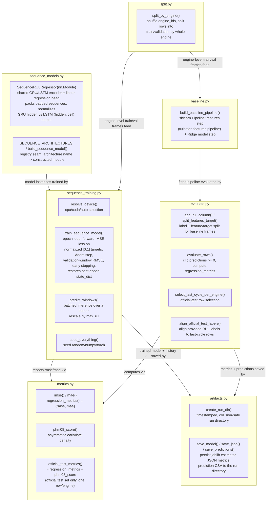

# `turbofan.models` Package Modules

```mermaid
flowchart TD
    subgraph baseline_py["baseline.py"]
        B1["build_baseline_pipeline()\nsklearn Pipeline: features step\n(turbofan.features.pipeline) + Ridge model step"]
    end

    subgraph sequence_models_py["sequence_models.py"]
        SM1["SequenceRULRegressor(nn.Module)\nshared GRU/LSTM encoder + linear regression head\npacks padded sequences, normalizes\nGRU hidden vs LSTM (hidden, cell) output"]
        SM2["SEQUENCE_ARCHITECTURES / build_sequence_model()\nregistry seam: architecture name -> constructed module"]
    end

    subgraph split_py["split.py"]
        SP1["split_by_engine()\nshuffle engine_ids, split rows into\ntrain/validation by whole engine"]
    end

    subgraph sequence_training_py["sequence_training.py"]
        ST1["resolve_device()\ncpu/cuda/auto selection"]
        ST2["train_sequence_model()\nepoch loop: forward, MSE loss on\nnormalized [0,1] targets, Adam step,\nvalidation-window RMSE, early stopping,\nrestores best-epoch state_dict"]
        ST4["predict_windows()\nbatched inference over a loader,\nrescale by max_rul"]
        ST5["seed_everything()\nseed random/numpy/torch"]
    end

    subgraph metrics_py["metrics.py"]
        M1["rmse() / mae()\nregression_metrics() = {rmse, mae}"]
        M2["phm08_score()\nasymmetric early/late penalty"]
        M3["official_test_metrics()\n= regression_metrics + phm08_score\n(official test set only, one row/engine)"]
    end

    subgraph evaluate_py["evaluate.py"]
        E1["add_rul_column() / split_features_target()\nlabel + feature/target split for baseline frames"]
        E2["evaluate_rows()\nclip predictions >= 0, compute regression_metrics"]
        E3["select_last_cycle_per_engine()\nofficial-test row selection"]
        E4["align_official_test_labels()\nalign provided RUL labels to last-cycle rows"]
    end

    subgraph artifacts_py["artifacts.py"]
        A1["create_run_dir()\ntimestamped, collision-safe run directory"]
        A2["save_model() / save_json() / save_predictions()\npersist joblib estimator, JSON metrics,\nprediction CSV to the run directory"]
    end

    sequence_models_py -->|"model instances trained by"| sequence_training_py
    sequence_training_py -->|"reports rmse/mae via"| metrics_py
    baseline_py -->|"fitted pipeline evaluated by"| evaluate_py
    evaluate_py -->|"computes via"| metrics_py
    split_py -->|"engine-level train/val frames feed"| baseline_py
    split_py -->|"engine-level train/val frames feed"| sequence_training_py
    sequence_training_py -->|"trained model + history saved by"| artifacts_py
    evaluate_py -->|"metrics + predictions saved by"| artifacts_py
```
