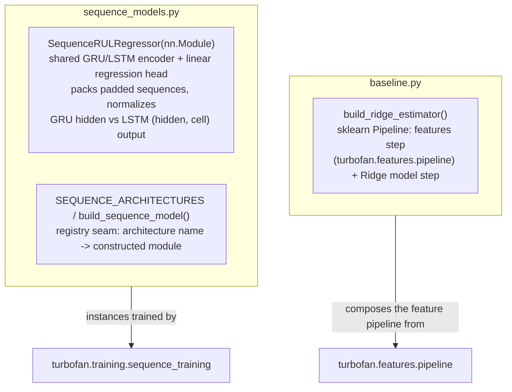

# `turbofan.models` Package Modules

`models/` holds only estimator and network definitions. Training workflows live
in `turbofan.training`; evaluation primitives in `turbofan.evaluation`.

```mermaid
flowchart TD
    subgraph baseline_py["baseline.py"]
        B1["build_ridge_estimator()\nsklearn Pipeline: features step\n(turbofan.features.pipeline) + Ridge model step"]
    end

    subgraph sequence_models_py["sequence_models.py"]
        SM1["SequenceRULRegressor(nn.Module)\nshared GRU/LSTM encoder + linear regression head\npacks padded sequences, normalizes\nGRU hidden vs LSTM (hidden, cell) output"]
        SM2["SEQUENCE_ARCHITECTURES / build_sequence_model()\nregistry seam: architecture name -> constructed module"]
    end

    baseline_py -->|"composes the feature pipeline from"| FeaturesNote["turbofan.features.pipeline"]
    sequence_models_py -->|"instances trained by"| TrainingNote["turbofan.training.sequence_training"]
```
