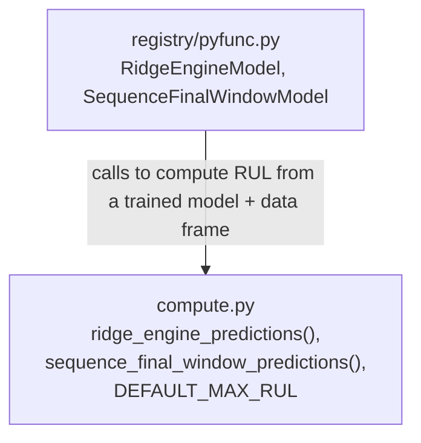

# `turbofan.predictions` module usage

`compute.py` is pure, framework-free math: it takes an already-trained
model object and a data frame and returns RUL predictions. It has no
MLflow or FastAPI knowledge. Its only consumer is `registry/pyfunc.py`,
which uses it to implement the `predict()` methods of its MLflow
`PythonModel` wrappers (`RidgeEngineModel`, `SequenceFinalWindowModel`).
