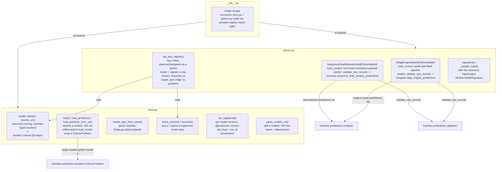

# `turbofan.registry` Package Modules

```mermaid
flowchart TD
    subgraph store_py["store.py"]
        S1["model_name() / resolve_uri()\ncanonical naming: turbofan-{type}-{subset}\n-> models:/&lt;name&gt;@&lt;alias&gt;"]
        S2["load() / load_predictor() / load_predictor_from_uri()\nresolve a models: URI via mlflow.pyfunc.load_model,\nwrap in PyfuncPredictor"]
        S3["model_type_from_name()\nparse 'turbofan-{ridge,gru,lstm}-{subset}'"]
        S4["latest_version() / promote()\nquery / repoint a registered-model alias"]
        S5["list_registered()\nper-model versions, @production version,\nval_rmse + run_id provenance"]
        S6["parse_models_uri()\nsplit a models: URI into name + alias/version"]
    end

    subgraph pyfunc_py["pyfunc.py"]
        P1["RidgeEngineModel(PythonModel)\nload_context: joblib.load fitted pipeline\npredict: validate_raw_records ->\ncompute.ridge_engine_predictions"]
        P2["SequenceFinalWindowModel(PythonModel)\nload_context: torch.load checkpoint payload\npredict: validate_raw_records ->\ncompute.sequence_final_window_predictions"]
        P4["log_and_register()\nlog a fitted pipeline/checkpoint as a pyfunc\nmodel + register a new version, branches on\nmodel_type (ridge vs gru/lstm)"]
        P5["_signature() / _sample_input()\ninfer the canonical input/output\nMLflow ModelSignature"]
    end

    subgraph init_py["__init__.py"]
        IN1["Public facade\nre-exports store.py + pyfunc.py under the\nturbofan.registry import path"]
    end

    P1 -->|"engine-scope predictions via"| ComputeNote["turbofan.predictions.compute"]
    P2 -->|"final-window predictions via"| ComputeNote
    P1 -->|"validate_raw_records"| ValidationNote["turbofan.predictions.validation"]
    P2 -->|"validate_raw_records"| ValidationNote
    P4 -->|"calls"| S1
    P4 -->|"calls"| S4
    S2 -->|"wraps loaded pyfunc model in"| PyfuncPredictorNote["turbofan.predictions.predictor.PyfuncPredictor"]
    init_py -->|"re-exports"| store_py
    init_py -->|"re-exports"| pyfunc_py
```
