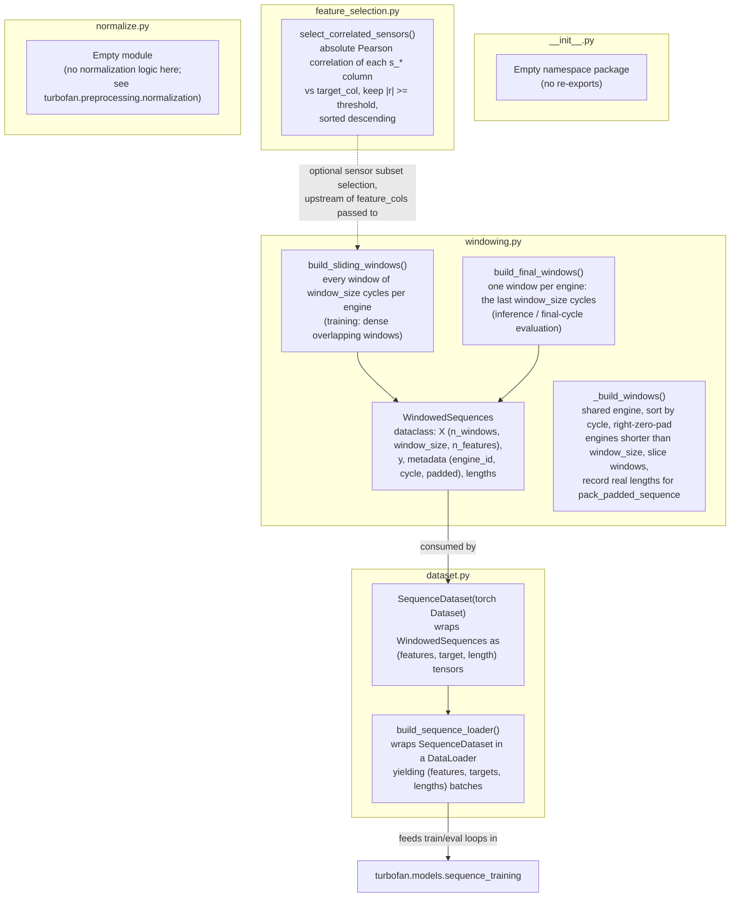

# `turbofan.sequences` Package Modules

```mermaid
flowchart TD
    subgraph init_py["__init__.py"]
        I1["Empty namespace package\n(no re-exports)"]
    end

    subgraph windowing_py["windowing.py"]
        W1["WindowedSequences\ndataclass: X (n_windows, window_size, n_features),\ny, metadata (engine_id, cycle, padded), lengths"]
        W2["build_sliding_windows()\nevery window of window_size cycles per engine\n(training: dense overlapping windows)"]
        W3["build_final_windows()\none window per engine: the last window_size cycles\n(inference / final-cycle evaluation)"]
        W4["_build_windows()\nshared engine, sort by cycle, right-zero-pad\nengines shorter than window_size, slice windows,\nrecord real lengths for pack_padded_sequence"]
    end

    subgraph dataset_py["dataset.py"]
        D1["SequenceDataset(torch Dataset)\nwraps WindowedSequences as\n(features, target, length) tensors"]
        D2["build_sequence_loader()\nwraps SequenceDataset in a DataLoader\nyielding (features, targets, lengths) batches"]
    end

    subgraph feature_selection_py["feature_selection.py"]
        F1["select_correlated_sensors()\nabsolute Pearson correlation of each s_* column\nvs target_col, keep |r| >= threshold,\nsorted descending"]
    end

    subgraph normalize_py["normalize.py"]
        NRM1["Empty module\n(no normalization logic here;\nsee turbofan.preprocessing.normalization)"]
    end

    W2 --> W1
    W3 --> W1
    W1 -->|"consumed by"| D1
    D1 --> D2
    D2 -->|"feeds train/eval loops in"| TrainingNote["turbofan.models.sequence_training"]
    F1 -.->|"optional sensor subset selection,\nupstream of feature_cols passed to"| W2
```
