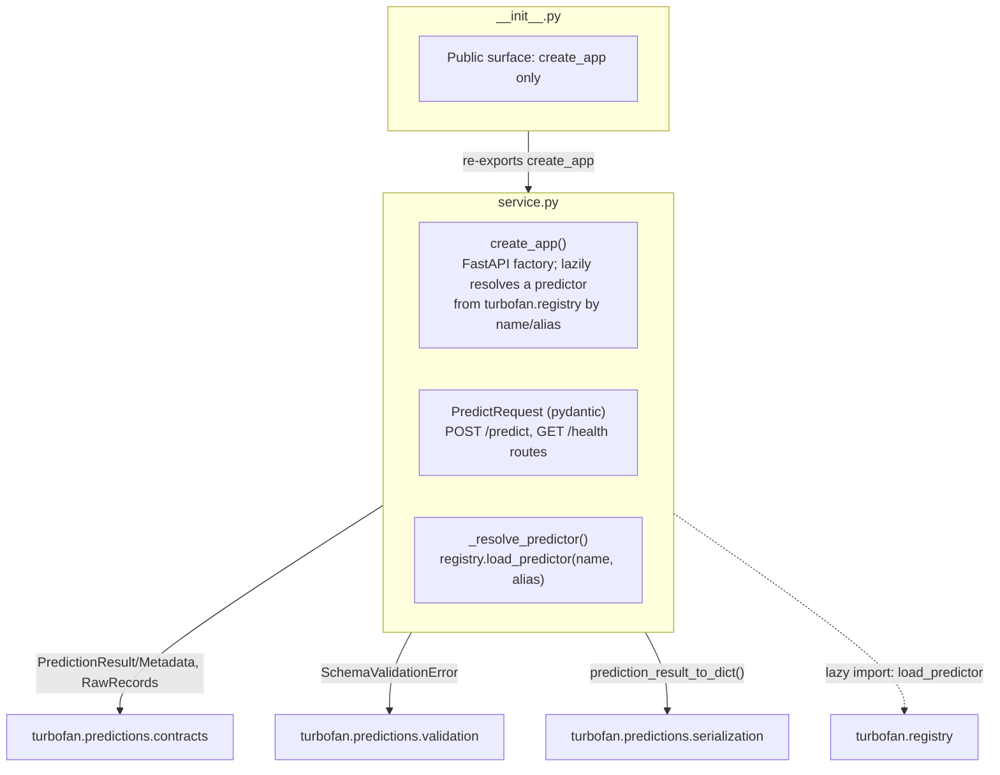

# `turbofan.serving` Package Modules

`serving/` is the FastAPI transport adapter only. Inference contracts,
validation, the pyfunc predictor adapter, and result serialization live inward
in `turbofan.predictions`.

