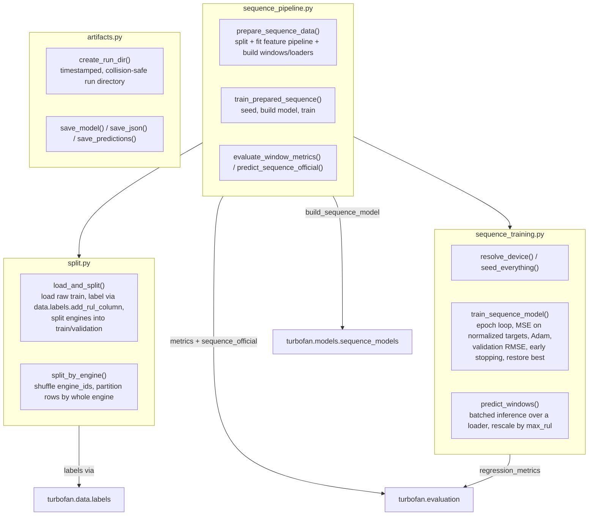

# `turbofan.training` Package Modules

`training/` holds the application-level train/evaluate use cases that compose
the data, feature, sequence, model, and evaluation layers. It is consumed by the
train CLIs, the benchmark jobs, and the feature-screen experiment.

